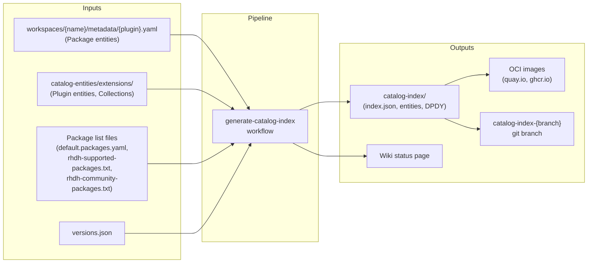
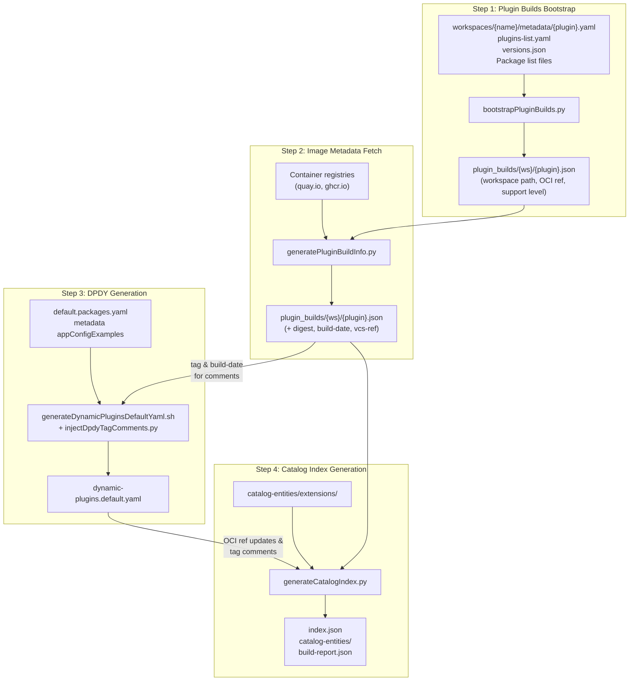

# Plugin Catalog Index

The **plugin catalog index** is the collection of community and supported plugins of this repository. It contains all the metadata, OCI image references, and default configuration needed for RHDH to discover and load dynamic plugins. This page explains how the catalog index is built, what it contains, and where it is published.

---

## Overview

The catalog index generation pipeline reads workspace metadata, queries container registries, and produces a self-contained directory of catalog entities and an `index.json` file. This directory is then packaged as an OCI image and pushed to a container registry, where RHDH consumes it.

### High-Level Flow




---

## Build Pipeline

The pipeline runs via the `[generate-catalog-index.yaml](../.github/workflows/generate-catalog-index.yaml)` workflow, triggered on pushes to `main` and `release-*` branches when relevant files change, or manually via `workflow_dispatch`.

The core orchestrator script is `[scripts/update-index.sh](../scripts/update-index.sh)`, which runs four steps in sequence:




### Step 1: Plugin Builds Bootstrap (`bootstrapPluginBuilds.py`)

Reads each `workspaces/*/metadata/*.yaml` file and constructs initial `plugin_builds/<workspace>/<image-name>.json` entries. Each entry includes the workspace path, support level, and a constructed OCI tag reference based on the registry type:

- **ghcr.io**: `bs_{backstage_version}__{plugin_version}` (e.g., `bs_1.49.4__0.8.2`)
- **quay.io/rhdh**: `{rhdh_version}--{plugin_version}` (e.g., `1.10--0.8.2`)

Plugins are filtered to only those matching the provided `--packages-file` list(s).

### Step 2: Image Metadata Fetch (`generatePluginBuildInfo.py`)

Queries the container registry for each plugin's OCI image to retrieve:

- **Digest** (`sha256:...`) for immutable references
- **Build date** and **VCS ref** from container labels
- **Upstream/midstream** repo refs from container env vars

Then updates `plugin_builds` with the relevant metadata.
Images that don't exist in the registry are logged as warnings.

#### Tag Resolution Strategy

For each plugin, the image metadata fetch follows a three-tier resolution:

1. **Exact tag match**: The constructed tag (e.g., `1.10.0--1.5.4`) is queried directly. If the image exists, its metadata is used as-is.

2. **RHDH version alias** (quay.io/rhdh only): If the exact tag is not found and the RHDH version prefix has three parts (x.y.z), the patch version is stripped to try the minor-version alias (e.g., `1.10.2--` → `1.10--`). This is because downstream builds are not repeated for each RHDH patch release if the plugin hasn't changed — a build done during `1.10.0` produces both `1.10.0--1.5.4` and `1.10--1.5.4` tags, and the `1.10--` alias remains valid for `1.10.1`, `1.10.2`, etc. If the exact plugin version is found under the alias, the resolved reference is used without marking it as a fallback. If the alias has tags but not the exact plugin version, the plugin is reported as not found — a new downstream build is needed.

3. **Fallback to latest version**: If the exact plugin version is not found under the original prefix, the latest published plugin version within that prefix is used. This is flagged as a fallback in the output, and the metadata YAML's `version:` field is updated to match. Fallback only applies within the original prefix — the alias (minor-version) prefix is only used for exact matches.

Alias resolution does not apply to ghcr.io (community) builds, which use Backstage version prefixes (`bs_x.y.z__`).

### Step 3: DPDY Generation (`generateDynamicPluginsDefaultYaml.sh`)

Generates `dynamic-plugins.default.yaml` — the default plugin configuration shipped with RHDH. This step only runs for the **supported** tier (requires a YAML-format packages file with enabled/disabled structure).

After generating the DPDY, the script calls `injectDpdyTagComments.py` to insert `# Tag: <tag>, Build date: <date>` comments from `plugin_builds/*.json` (produced by Steps 1-2). Each plugin's `registryReference` tag and `build-date` label are extracted from the enriched JSON files and placed as comments above the corresponding `- package:` lines. This provides traceability from each plugin entry back to the specific OCI image tag and build date, without requiring live registry API calls (which previously caused Quay API timeouts).

Inputs:

- `default.packages.yaml` — lists which plugins are enabled vs disabled by default
- `workspaces/*/metadata/*.yaml` — `spec.appConfigExamples[0].content` provides the `pluginConfig` for each plugin
- `plugin_builds/*.json` — provides tag and build-date metadata for comment injection

Output structure (truncated):

```yaml
plugins:
  # Tag: 1.10--0.8.2, Build date: 2026-05-20T13:45:25Z
  - package: oci://quay.io/rhdh/red-hat-developer-hub-backstage-plugin-adoption-insights:1.10--0.8.2
    enabled: true
    pluginConfig:
      dynamicPlugins:
        frontend:
          red-hat-developer-hub.backstage-plugin-adoption-insights:
            # ... frontend wiring config
  # Tag: 1.10--1.2.0, Build date: 2026-05-19T09:12:00Z
  - package: oci://quay.io/rhdh/backstage-community-plugin-acr:1.10--1.2.0
    enabled: false
```

### Step 4: Catalog Index Generation (`generateCatalogIndex.py`)

The final step that produces the catalog index:

1. Copies `catalog-entities/extensions/` (Plugin entities, collections) to the output directory
2. Copies `workspaces/*/metadata/*.yaml` (Package entities) to the `packages` directory of the catalog index output directory
3. Scrubs entities to only include packages matching the package list filter
4. Verifies each plugin's OCI image exists in the registry
5. Generates `index.json` with digest-based references
6. Updates Package entity files and DPDY with OCI references and Tag/Build date comments
7. Regenerates `all.yaml` location files

---

## Output Artifacts

The generated `catalog-index/<tier>/` directory contains:


| File                                             | Purpose                                                                                   |
| ------------------------------------------------ | ----------------------------------------------------------------------------------------- |
| `index.json`                                     | Main index mapping plugin image names to OCI refs with digests                            |
| `catalog-entities/extensions/packages/*.yaml`    | Package entity definitions with resolved OCI references                                   |
| `catalog-entities/extensions/plugins/*.yaml`     | Plugin entity definitions (descriptions, icons, categories)                               |
| `catalog-entities/extensions/collections/*.yaml` | Collection groupings (featured, recommended, etc.)                                        |
| `dynamic-plugins.default.yaml`                   | Default plugin configuration (supported tier only)                                        |
| `build-info.json`                                | Build metadata (date, versions, source commit)                                            |
| `build-report.json`                              | Detailed per-plugin build status with stage tracking (not included in final OCI artifact) |


---

## Support Tiers

The pipeline runs twice per build — once for each tier:

### Supported Catalog

Plugins with Red Hat support (GA or Tech Preview heading to GA).

- **Filter**: Union of `default.packages.yaml` + `rhdh-supported-packages.txt`
- **Registry**: `quay.io/rhdh` (plugins registry) / `quay.io/rhdh-community` (catalog index image registry)
- **Published to**: `quay.io/rhdh-community/plugin-catalog-index`
- **Tags**: `bs_{backstage_version}-{short_sha}`, `bs_{backstage_version}`, `latest`
- **Includes DPDY**: Yes

### Community Catalog

Community-supported plugins.

- **Filter**: `rhdh-community-packages.txt`
- **Registry**: `ghcr.io/redhat-developer/rhdh-plugin-export-overlays`
- **Published to**: `ghcr.io/redhat-developer/rhdh-plugin-export-overlays/plugin-catalog-index`
- **Tags**: `bs_{backstage_version}-{short_sha}`, `bs_{backstage_version}`, `latest`
- **Includes DPDY**: No

---

## Where to Find Status

After each build, a status page is automatically pushed to the GitHub Wiki:

- **Index page**: [Plugin Catalog Index Status](https://github.com/redhat-developer/rhdh-plugin-export-overlays/wiki/Plugin-Catalog-Index-Status) — links to all branch status pages
- **Per-branch pages**: `Plugin-Catalog-Status-{branch}` — shows which plugins passed/failed and why

The status page includes:

- Build metadata (date, commit, versions)
- Summary counts per tier (total, passed, failed)
- Per-plugin tables with links to metadata files, OCI references, and failure reasons
- Links to the workflow run for debugging failures

The raw `build-report.json` files are also available on the `catalog-index-{branch}` git branch in `catalog-index/supported/build-report.json` and `catalog-index/community/build-report.json`.

---

## Triggering a Build

### Automatic

Pushes to `main` or `release-*` branches that modify any of these paths trigger the workflow:

- `workspaces/*/metadata/*.yaml`
- `catalog-entities/extensions/**`
- `default.packages.yaml`, `rhdh-supported-packages.txt`, `rhdh-community-packages.txt`
- `scripts/**`
- `versions.json`

### Manual

```bash
# Build from main, push to catalog-index-main
gh workflow run generate-catalog-index.yaml

# Build from a specific branch
gh workflow run generate-catalog-index.yaml -f source-branch=release-1.9

# Build from one branch, push catalog to a custom target branch
gh workflow run generate-catalog-index.yaml \
  -f source-branch=main \
  -f target-branch=catalog-index-custom
```

## Extracting Content From a Catalog Index Image

To extract the contents from a catalog index image, run this script:

```
unpack () {
  if [[ ! $1 ]]; then
    echo "Usage: unpack reg/org/container:tagorsha"
  else  
    local IMAGE="$1"
    DIR="${IMAGE//:/_}"
    DIR="/tmp/${DIR//\//-}"
    rm -fr "$DIR"; mkdir -p "$DIR"; container_id=$(podman create "${IMAGE}")
    podman export $container_id -o /tmp/image.tar && tar xf /tmp/image.tar -C "${DIR}/"; podman rm $container_id; rm -f /tmp/image.tar
    echo "Unpacked $IMAGE into $DIR"
    cd $DIR; tree -d -L 3 -I "usr|root|buildinfo"
  fi
}

unpack ghcr.io/redhat-developer/rhdh-plugin-export-overlays/plugin-catalog-index:1.11-bs_1.49.4 
unpack quay.io/rhdh-community/plugin-catalog-index:<some tag>
```
Once unpacked, you should see a tree of metadata files to browse, as well as `index.json` and `build-info.json`.

```
.
└── catalog-entities
    └── extensions
        ├── collections
        ├── packages
        └── plugins
```
