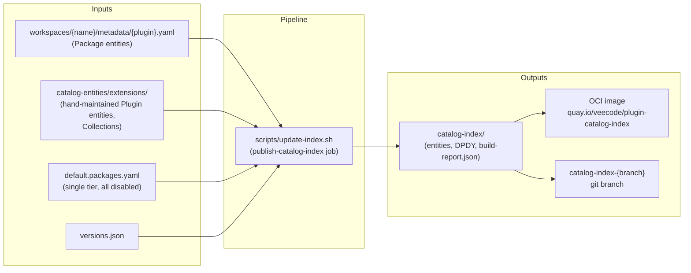
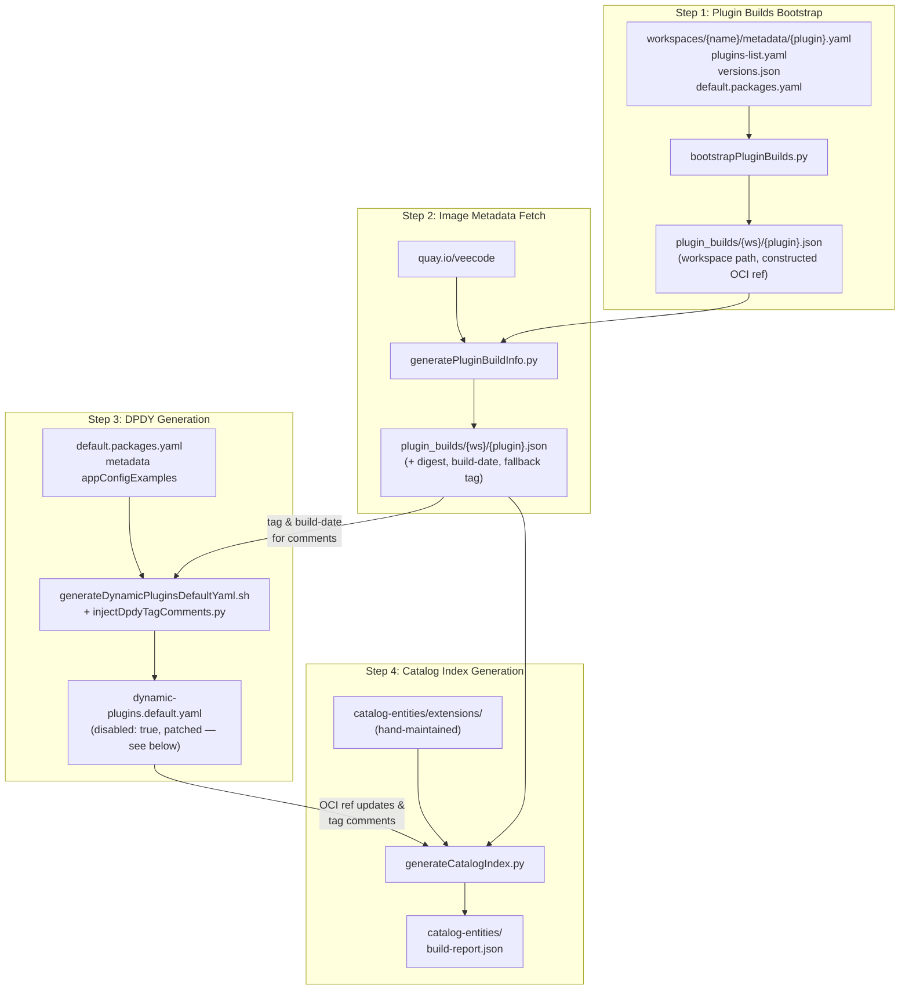

# Plugin Catalog Index

The **plugin catalog index** is the collection of plugins published by this repository. It contains all the metadata, OCI image references, and default configuration needed for RHDH to discover and load dynamic plugins. This page explains how the catalog index is built, what it contains, and where it is published.

> **This fork now runs upstream RHDH's index-generation pipeline** (`bootstrapPluginBuilds.py` / `generatePluginBuildInfo.py` / `generateDynamicPluginsDefaultYaml.sh` / `generateCatalogIndex.py`, orchestrated by `scripts/update-index.sh`), adopted in WS-2a (ADR-008, packaging convergence — see devportal-planning). This *reverses* the 2026-08-20 decision recorded in an earlier version of this page: that decision rejected the upstream pipeline because it assumed **one OCI image per npm plugin package** with `bs_X__Y` tags, while this fork published **one OCI image per workspace** (`!selector`-addressed, `bs_<version>` tags). ADR-008's per-plugin dual publish (`also-publish-plugins`, phase 1) closed that gap — this fork now publishes one OCI image per plugin too, under `quay.io/veecode/<plugin>:bs_<backstage>__<version>`, matching upstream's own tag shape. Adopting the pipeline unmodified was still not possible: a handful of small, explicit patches (see below) teach it that `quay.io/veecode` is a ghcr.io-shaped registry, and it runs as a **single tier** instead of upstream's supported/community split — there is no fork equivalent to `rhdh-supported-packages.txt` / `rhdh-community-packages.txt`. It also runs in `publish-catalog-index` (a job in `publish-release-branch-workspace-plugins.yaml`), not upstream's dedicated `generate-catalog-index.yaml` — see "How this fork's build differs" below for why.

---

## Overview

The catalog index generation pipeline reads workspace metadata, queries container registries, and produces a self-contained directory of catalog entities. This directory is then packaged as an OCI image and pushed to `quay.io/veecode/plugin-catalog-index`, where RHDH consumes it via `CATALOG_INDEX_IMAGE` + `{{inherit}}`.

### High-Level Flow


```mermaid
flowchart LR
    subgraph Inputs
        META["workspaces/{name}/metadata/{plugin}.yaml<br/>(Package entities)"]
        CATS["catalog-entities/extensions/<br/>(hand-maintained Plugin entities,<br/>Collections)"]
        PKGS["default.packages.yaml<br/>(single tier, all disabled)"]
        VERS["versions.json"]
    end

    subgraph Pipeline
        GEN["scripts/update-index.sh<br/>(publish-catalog-index job)"]
    end

    subgraph Outputs
        IDX["catalog-index/<br/>(entities, DPDY, build-report.json)"]
        OCI["OCI image<br/>quay.io/veecode/plugin-catalog-index"]
        BRANCH["catalog-index-{branch}<br/>git branch"]
    end

    META --> GEN
    CATS --> GEN
    PKGS --> GEN
    VERS --> GEN
    GEN --> IDX
    IDX --> OCI
    IDX --> BRANCH
```

---

## Build Pipeline

The pipeline runs inside the `publish-catalog-index` job of `[publish-release-branch-workspace-plugins.yaml](../.github/workflows/publish-release-branch-workspace-plugins.yaml)`, which itself runs after `export` on every push to a release branch (and on release-candidate dispatches, under an isolated tag/branch — see "Release candidates" below).

The core orchestrator script is `[scripts/update-index.sh](../scripts/update-index.sh)` (upstream, unmodified), which runs four steps in sequence:


```mermaid
flowchart TB
    subgraph "Step 1: Plugin Builds Bootstrap"
        S1_IN["workspaces/{name}/metadata/{plugin}.yaml<br/>plugins-list.yaml<br/>versions.json<br/>default.packages.yaml"]
        S1["bootstrapPluginBuilds.py"]
        S1_OUT["plugin_builds/{ws}/{plugin}.json<br/>(workspace path, constructed OCI ref)"]
        S1_IN --> S1 --> S1_OUT
    end

    subgraph "Step 2: Image Metadata Fetch"
        S2["generatePluginBuildInfo.py"]
        S2_OUT["plugin_builds/{ws}/{plugin}.json<br/>(+ digest, build-date, fallback tag)"]
        S1_OUT --> S2
        REG["quay.io/veecode"] --> S2
        S2 --> S2_OUT
    end

    subgraph "Step 3: DPDY Generation"
        S3_IN["default.packages.yaml<br/>metadata appConfigExamples"]
        S3["generateDynamicPluginsDefaultYaml.sh<br/>+ injectDpdyTagComments.py"]
        S3_OUT["dynamic-plugins.default.yaml<br/>(disabled: true, patched — see below)"]
        S3_IN --> S3
        S2_OUT -- "tag & build-date<br/>for comments" --> S3
        S3 --> S3_OUT
    end

    subgraph "Step 4: Catalog Index Generation"
        S4["generateCatalogIndex.py"]
        S4_OUT["catalog-entities/<br/>build-report.json"]
        S2_OUT --> S4
        S3_OUT -- "OCI ref updates &<br/>tag comments" --> S4
        CATS2["catalog-entities/extensions/<br/>(hand-maintained)"] --> S4
        S4 --> S4_OUT
    end
```

### Step 1: Plugin Builds Bootstrap (`bootstrapPluginBuilds.py`)

Reads each `workspaces/*/metadata/*.yaml` file belonging to an **active** workspace (has a `plugins-list.yaml` without `.disabled`) and constructs initial `plugin_builds/<workspace>/<image-name>.json` entries. Each entry includes the workspace path and a constructed OCI tag reference. `default.packages.yaml` filters which plugins get an entry at all — face-owned and disabled-workspace packages are omitted from that file on purpose (see "What's excluded" below).

- **ghcr.io, or `quay.io/veecode` (FORK PATCH)**: `bs_{backstage_version}__{plugin_version}` (e.g., `bs_1.52.0__0.26.0`)
- **quay.io/rhdh** (not used by this fork): `{rhdh_version}--{plugin_version}`

### Step 2: Image Metadata Fetch (`generatePluginBuildInfo.py`)

Queries `quay.io/veecode` for each plugin's constructed image reference to retrieve its digest and build metadata, resolving to the latest published tag under the same prefix if the exact version isn't found yet (fallback — flagged in `build-report.json`). Images that don't exist at all are recorded as `fail` in the report.

`quay.io/veecode` is treated as ghcr.io-shaped everywhere upstream branches on registry type (see "Patches to upstream" below) — it has no `RHDH_VERSION`/downstream tag convention.

### Step 3: DPDY Generation (`generateDynamicPluginsDefaultYaml.sh`)

Generates `dynamic-plugins.default.yaml` from `default.packages.yaml` + each package's `spec.appConfigExamples[0].content`. Every entry in this fork's `default.packages.yaml` is listed under `packages.disabled`, and the generator has been patched to emit the literal `disabled: true` key (see "Patches to upstream" below) — upstream emits `enabled:`.

### Step 4: Catalog Index Generation (`generateCatalogIndex.py`)

1. Copies `catalog-entities/extensions/` (hand-maintained Plugin entities, Collections — **never regenerated**) into the output directory.
2. Copies **every** `workspaces/*/metadata/*.yaml` (Package entities) into the output's `packages/` directory, **unfiltered** — including disabled-workspace and face-owned packages. This is why the marketplace UI still sees face-owned plugins even though they're excluded from the DPDY (see below).
3. Verifies each `plugin_builds/`-listed plugin's OCI image exists in `quay.io/veecode`, resolving digests and fallback tags.
4. Updates the copied Package entity files and the DPDY with resolved OCI references and tag/build-date comments.
5. Regenerates `all.yaml` location files in `packages/` and `plugins/`.

Plugins with no resolvable image are logged as warnings by this script and shipped without an OCI ref rewrite (their DPDY entry, if any, keeps whatever `dynamicArtifact` the metadata already had). The `publish-catalog-index` job adds its own fail-loud check on top — see "Validation" below.

---

## What's excluded

**Disabled workspaces** (no `plugins-list.yaml`, or `.disabled`): never fleet-published, so their packages don't appear in `default.packages.yaml` and get no `plugin_builds/` entry. Their Package *entities* are still copied into `catalog-entities/extensions/packages/` (step 4.2 above is unfiltered), same as before this change.

**Face-owned packages** (workspaces `marketplace`, `veecode-homepage`, `veecode-theme`): the VeeCode product face ships these baked into the devportal-core image (`dynamic-plugins.veecode.yaml`), which is their canonical version source (ADR-005/ADR-006 — "face out of the index"). A same-level duplicate plugin key between that baked file and this DPDY is a fatal `InstallException` at RHDH 1.10 installer merge time regardless of `disabled` state, so these packages are omitted from `default.packages.yaml` entirely (commented there). Their entities are still copied unfiltered, same as disabled workspaces.

**`vertigo-theme` stays in, on purpose**: it looks structurally identical to `veecode-theme` (a tenant-specific baked theme plugin), but the vertigo tenant's production stack resolves `vertigo-platform-plugin-vertigo-theme` via `{{inherit}}` against this DPDY today (`values-fork.yaml.tpl`, helm rev 26, live) — excluding it would break theme version resolution in that tenant's production. Confirmed with the repo owner; not an oversight.

---

## Patches to upstream

This fork does not carry a diverged copy of the upstream scripts — it imports them and layers small, commented deltas on top (see the fork's git history for the exact diffs):

| File | Patch |
| --- | --- |
| `scripts/plugin_utils.py` | Added `uses_ghcr_tag_scheme()` / `GHCR_LIKE_REGISTRIES = ("ghcr.io", "quay.io/veecode")` — shared by the two patches below. |
| `scripts/bootstrapPluginBuilds.py` | `construct_registry_reference()` and the `--rhdh-version` requirement check use `uses_ghcr_tag_scheme()` instead of a bare `'ghcr.io' in registry_base` check. |
| `scripts/generatePluginBuildInfo.py` | `resolve_fallback_tag()`'s separator detection and `_registry_tag_separator()` use `uses_ghcr_tag_scheme()` — otherwise `quay.io/veecode` would fall into the `quay.io/rhdh`-style `--` separator and RHDH-version alias logic, which doesn't apply here. |
| `scripts/generateDynamicPluginsDefaultYaml.sh` | `build_plugin_entry()` emits `disabled: (…)` instead of upstream's `enabled: (…)` — this fork's DPDY consumer contract (ADR-005/ADR-006, the installer's fatal-duplicate-key behavior) requires the literal `disabled: true` key on every entry. |

Everywhere else — `generateCatalogIndex.py`, `plugin_utils.py`'s `get_registry_auth()` / `check_image_exists()`'s auth fallback (`REGISTRY_USERNAME`/`REGISTRY_PASSWORD` for any non-ghcr.io registry, which already covers `quay.io/veecode` correctly) — is upstream, unmodified.

---

## How this fork's build differs from upstream's `generate-catalog-index.yaml`

- **Single tier.** No supported/community split, no `rhdh-supported-packages.txt` / `rhdh-community-packages.txt`. One `default.packages.yaml`, one registry (`quay.io/veecode`), one output image.
- **Runs inside `publish-catalog-index`, not a separate push-triggered workflow.** Upstream's `generate-catalog-index.yaml` triggers on its own push filter, independent of plugin publishing. Wiring it that way here would race the fleet's own image publish (`export` job): the index could be generated and published referencing images the fleet hasn't pushed yet, causing the same kind of silent exclusion the `disabled` "no plugins-list.yaml" handling already guards against for workspaces. Instead, index generation is a job **downstream of `export`** in the same workflow run, so it only ever runs after the images it references have already been pushed.
- **Release-candidate isolation.** A candidate dispatch (`rc-tag-suffix` set) generates and pushes the index too — a platform image bakes `plugin-catalog-index:bs_<version>` at build time and needs *some* index to build against on a brand-new Backstage version — but under an isolated OCI tag (`bs_<version><rc-tag-suffix>`) and an isolated `catalog-index-<branch><rc-tag-suffix>` git branch, never the release tag/branch a real publish would use.
- **No wiki status page / GitHub Pages rendering.** Upstream's `renderCatalogStatus.py` + wiki-push step were not adopted — `catalog-index/build-report.json` (committed to the `catalog-index-<branch>` branch) is the source of truth for what passed/failed/fell back.
- **`:latest` stays promotion-only.** Same rule as before this change: `promote-catalog-index-latest.yaml` is the only workflow allowed to move `plugin-catalog-index:latest`. `publish-catalog-index` only ever writes versioned tags.
- **Digest pinning retired.** The retired `generate-dpdy-index.sh` pinned every DPDY entry to `@sha256:<digest>` via a `skopeo inspect` gate that failed the whole build if any image was unreachable. The decided final ref format is a plain tag (`oci://<image>:<tag>`), matching what upstream's pipeline produces. The **fail-loud guarantee itself is preserved**, just moved: `publish-catalog-index`'s "Validate catalog index" step reads `build-report.json` and fails the job if any plugin has no resolvable image (`summary.failed > 0`) — the same guarantee that exists because of the 2026-08-20 incident recorded in `.github/workflows/audit-quay-visibility.yaml` (13 of 63 metadata-referenced images were unreachable and got published anyway). A resolved-via-fallback plugin is a warning, not a failure — that plugin has a real, older, verified image.

---

## Output Artifacts

The generated `catalog-index/` directory (an ephemeral CI working directory — see `.gitignore` — committed only to the `catalog-index-<branch>` git branch) contains:

| File | Purpose |
| --- | --- |
| `catalog-entities/extensions/packages/*.yaml` | Package entity definitions, resolved OCI references where an image was found |
| `catalog-entities/extensions/plugins/*.yaml` | Hand-maintained plugin entity definitions (descriptions, icons, categories) — copied verbatim, never generated |
| `catalog-entities/extensions/collections/*.yaml` | Hand-maintained collection groupings (featured, recommended, etc.) — copied verbatim |
| `dynamic-plugins.default.yaml` | Default plugin configuration, every entry `disabled: true` |
| `default.packages.yaml` | Copy of the input package list, for traceability |
| `build-report.json` | Per-plugin build status with stage tracking — read by the CI validation step, not included in the final OCI image |

This tree is packaged into the OCI image by `catalog-entities/Containerfile`, built with `catalog-index/` as the build context (see the Containerfile's own comments for why the dual `COPY` — `/extensions/` and `/catalog-entities/extensions/` — must stay in a single layer).

---

## Where to Find Status

The raw `build-report.json` is committed to the `catalog-index-<branch>` git branch (or `catalog-index-<branch><rc-tag-suffix>` for a candidate run) alongside the rest of the generated tree, at `catalog-index/build-report.json`. There is no wiki status page (see "How this fork's build differs" above).

---

## Extracting Content From a Catalog Index Image

To extract the contents from a catalog index image, run this script:

```
unpack () {
  if [[ ! $1 ]]; then
    echo "Usage: unpack reg/org/container:tagorsha"
  else  
    local IMAGE="$1"
    DIR="${IMAGE//:/_}"
    DIR="/tmp/${DIR//\//-}"
    rm -fr "$DIR"; mkdir -p "$DIR"; container_id=$(podman create "${IMAGE}")
    podman export $container_id -o /tmp/image.tar && tar xf /tmp/image.tar -C "${DIR}/"; podman rm $container_id; rm -f /tmp/image.tar
    echo "Unpacked $IMAGE into $DIR"
    cd $DIR; tree -d -L 3 -I "usr|root|buildinfo"
  fi
}

unpack quay.io/veecode/plugin-catalog-index:bs_1.52.0
```

Once unpacked, you should see:

```
.
├── dynamic-plugins.default.yaml
├── extensions
│   ├── collections
│   ├── packages
│   └── plugins
└── catalog-entities
    └── extensions
        ├── collections
        ├── packages
        └── plugins
```

(`extensions/` and `catalog-entities/extensions/` are the same content, duplicated — see the Containerfile comments for why both copies exist.)
